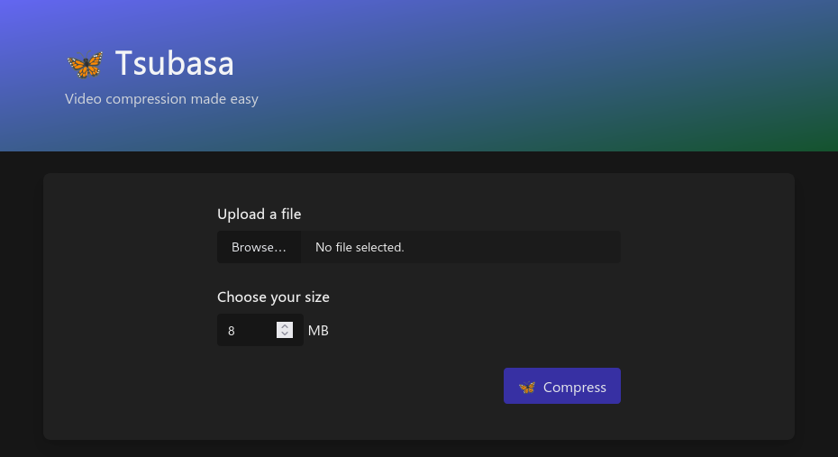

# Tsubasa 🦋

Tsubasa is a fast video compression service that runs locally on your device. Maintain the best quality while staying under MB file limits.

 

## Why Tsubasa

Tsubasa was created as a proof-of-concept for a ffmpeg-wasm implementation.

- ✅ Allows transcoding to a size limit (for services with a file size upload limit)
- ✅ Allows scaling resolution, to preserve video quality/bitrate
- ✅ Preserves audio quality
- ✅ Runs locally on your device

## Development

With [the return of secure WASM support in browsers](https://hacks.mozilla.org/2020/07/safely-reviving-shared-memory/), we wanted to see: Could we actually build a server-less compression service, running a desktop program, purely in JavaScript and WebAssembly?

Tsubasa is a work in progress, and welcomes feature suggestions, bug reports, and pull requests.

[See the Wiki for development setup >](https://github.com/matchamoon/tsubasa/wiki)

Tsubasa was named after [翼, the Japanese kanji for "wing"](https://jisho.org/search/%E7%BF%BC).
